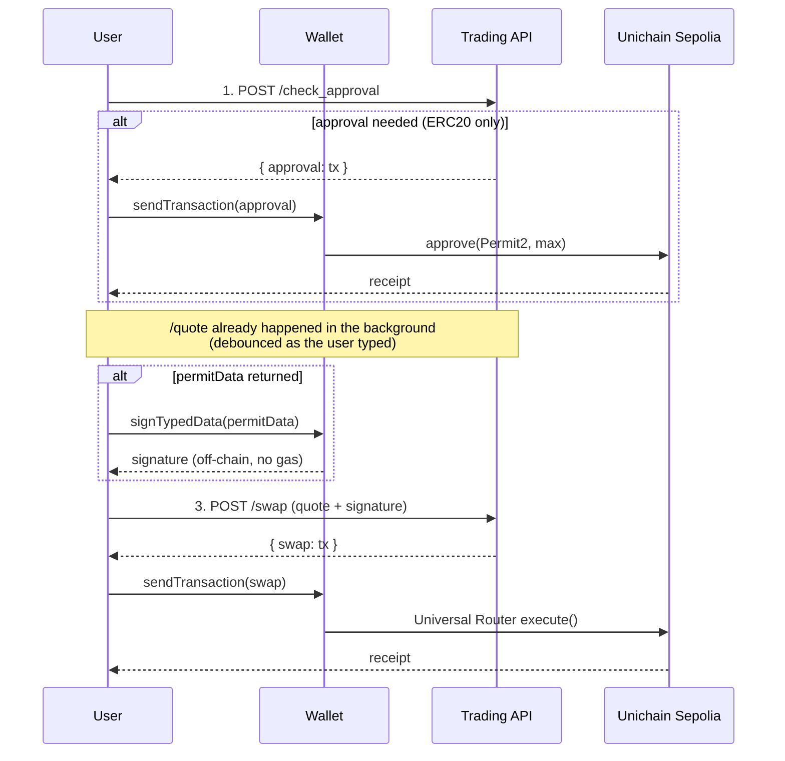

# Presentation walkthrough — How the Swap Widget talks to the Uniswap Trading API

> A presenter-friendly tour of the code. The story is one sentence:
>
> The user types an amount → we call **`/check_approval`**, **`/quote`**, then **`/swap`**, and the wallet just signs and broadcasts whatever the API hands back.
>
> Everything else is plumbing around those three calls.

There are four pieces worth hovering over on screen:

1. The CORS proxy that makes browser → API calls possible at all
2. The Trading API client (`lib/tradingApi.ts`) — the only file that knows about HTTP
3. The orchestrator (`hooks/useSwapFlow.ts`) — the multi-step state machine
4. The background quote runner (`hooks/useQuote.ts`)

---

## 1. The CORS problem nobody warns you about

The Trading API at `https://trade-api.gateway.uniswap.org/v1` doesn't accept browser CORS preflights — it returns `415 Unsupported Media Type` on `OPTIONS`. So `fetch()` straight from React always fails.

We solve it once with a Vite dev proxy.

**`swap-widget/vite.config.ts`** (lines 12–21):

```ts
  server: {
    proxy: {
      '/api/uniswap': {
        target: 'https://trade-api.gateway.uniswap.org/v1',
        changeOrigin: true,
        rewrite: (p) => p.replace(/^\/api\/uniswap/, ''),
      },
    },
  },
```

Then in the rest of the app we just call `/api/uniswap/quote` and the dev server proxies it.

> **Talking point:** in production this becomes a Vercel/Cloudflare rewrite that injects `x-api-key` server-side, so the key never reaches the browser.

---

## 2. The Trading API client — three small functions in `lib/tradingApi.ts`

This is the **only** file that knows about HTTP. Everything else just calls TypeScript functions.

### Headers (set once, used everywhere)

**`swap-widget/src/lib/tradingApi.ts`** (lines 4–10):

```ts
const API_KEY = import.meta.env.VITE_UNISWAP_API_KEY ?? '';

const BASE_HEADERS = {
  'Content-Type': 'application/json',
  'x-api-key': API_KEY,
  'x-universal-router-version': '2.0',
} as const;
```

`x-universal-router-version: 2.0` is the magic header that opts you into V4 routes — without it you're stuck on the old router.

### Step 1 — "do I need an approval transaction?"

**`swap-widget/src/lib/tradingApi.ts`** (lines 103–110):

```ts
export async function checkApproval(params: {
  walletAddress: Address;
  token: Address;
  amount: string;
  chainId: number;
}): Promise<CheckApprovalResponse> {
  return postJson<CheckApprovalResponse>('/check_approval', params);
}
```

The response is either `{ approval: null }` (already approved → skip) or `{ approval: { to, data, value, ... } }` — a **fully-formed transaction** the user can just sign. We never construct an `approve()` call ourselves.

### Step 2 — get the quote

**`swap-widget/src/lib/tradingApi.ts`** (lines 112–134):

```ts
export async function getQuote(params: {
  swapper: Address;
  tokenIn: Address;
  tokenOut: Address;
  chainId: number;
  amount: string;
  slippageTolerance: Slippage;
}): Promise<ClassicQuoteResponse> {
  const body = {
    swapper: params.swapper,
    tokenIn: params.tokenIn,
    tokenOut: params.tokenOut,
    tokenInChainId: String(params.chainId),
    tokenOutChainId: String(params.chainId),
    amount: params.amount,
    type: 'EXACT_INPUT',
    slippageTolerance: params.slippageTolerance,
    // BEST_PRICE on Unichain Sepolia returns CLASSIC routes (UniswapX is mainnet-only).
    routingPreference: 'BEST_PRICE',
    protocols: ['V2', 'V3', 'V4'],
  };
  return postJson<ClassicQuoteResponse>('/quote', body);
}
```

Things to call out on stage:

- **Chain IDs are strings**, not numbers. The API rejects `tokenInChainId: 1301` (number) but accepts `"1301"`. This caught me out.
- `EXACT_INPUT` — we say "spend exactly X of token A" and the API tells us what we'll get out. The opposite, `EXACT_OUTPUT`, is also supported.
- `routingPreference: 'BEST_PRICE'` — on mainnet this would route through UniswapX (gasless Dutch auctions); on Unichain Sepolia it falls back to a normal AMM (`CLASSIC`).
- `protocols: ['V2','V3','V4']` — the API picks the best of the three for you. The route visualization at the bottom of the card shows which one was chosen.

### Step 3 — convert the quote into a transaction

**`swap-widget/src/lib/tradingApi.ts`** (lines 136–158):

```ts
export async function getSwap(
  quoteResponse: ClassicQuoteResponse,
  permit2Signature?: Hex,
): Promise<SwapResponse> {
  // Strip permitData/permitTransaction; handle permit fields explicitly.
  // (Skill rule: spread the quote into the body, never wrap in {quote: ...}.)
  const {
    permitData,
    // permitTransaction may exist on some responses
    ...cleanQuote
  } = quoteResponse as ClassicQuoteResponse & {
    permitTransaction?: unknown;
  };

  const body: Record<string, unknown> = { ...cleanQuote };

  if (permit2Signature && permitData && typeof permitData === 'object') {
    body.signature = permit2Signature;
    body.permitData = permitData;
  }

  return postJson<SwapResponse>('/swap', body);
}
```

This is the **single most pitfall-heavy** function in the codebase. Three rules:

1. **Spread the quote response into the body** — `{ ...quoteResponse, signature }`. If you wrap it as `{ quote: quoteResponse, signature }` the API rejects it with `"quote does not match any of the allowed types"`.
2. **Never send `permitData: null`** — the API rejects null even though it sometimes sends you null. Hence the destructure-then-conditionally-re-add pattern.
3. **`signature` and `permitData` go together or not at all** for CLASSIC routes. (For UniswapX routes the rules differ — only `signature` goes back, `permitData` stays local — but we're on testnet so we don't hit that case.)

The response is again a **fully-formed transaction** — `{ to, data, value }` ready to sign.

### Belt-and-braces validation

**`swap-widget/src/lib/tradingApi.ts`** (lines 160–173):

```ts
export function validateSwapTx(tx: SwapTx): void {
  const data = tx?.data as string | undefined;
  if (!data || data === '' || data === '0x') {
    throw new Error('swap.data is empty — quote may have expired. Please refresh.');
  }
  if (!isHex(tx.data)) {
    throw new Error('swap.data is not valid hex');
  }
  if (!isAddress(tx.to)) throw new Error('swap.to is not a valid address');
  if (!isAddress(tx.from)) throw new Error('swap.from is not a valid address');
```

If a quote has expired (~30s) you can sometimes get a 200 response with an empty `data: '0x'` field, which would silently revert on-chain. We catch that before the user pays gas.

---

## 3. The orchestrator — `hooks/useSwapFlow.ts`

This is the **state machine** that calls those three API functions in order, with the wallet sandwiched between them.

### The headline diagram for your slide



### The three stage-managed steps in code

In `useSwapFlow.ts`, lines 88–118 **plan** the steps based on the quote (so the modal shows the right indicators before any wallet popup), then 130–198 **execute** them.

#### Step 1 — approval (ERC20 only)

**`swap-widget/src/hooks/useSwapFlow.ts`** (lines 130–156):

```ts
        // Step 1: Approval (if ERC20)
        if (needsApprovalCheck) {
          setStep('approve', { state: 'pending' });
          const approvalRes = await checkApproval({
            walletAddress: account,
            token: tokenIn.address,
            amount: rawAmount.toString(),
            chainId: UNICHAIN_SEPOLIA_ID,
          });

          if (approvalRes.approval) {
            approvalNeeded = true;
            const hash = await walletClient.sendTransaction({
              to: approvalRes.approval.to,
              data: approvalRes.approval.data,
              value: BigInt(approvalRes.approval.value || '0'),
            });
            await publicClient.waitForTransactionReceipt({ hash });
            setStep('approve', { state: 'success' });
          } else {
            // Already approved — collapse to success without submitting
            setStep('approve', {
              state: 'success',
              description: 'Already approved',
            });
          }
        }
```

Three states the user can land in:

- **Native ETH input:** step skipped entirely (`needsApprovalCheck = !tokenIn.isNative`).
- **Already approved:** the API returns `approval: null`, we tick the step green instantly.
- **Needs approval:** the API gives us a ready-made tx, we sign and wait for confirmation.

#### Step 2 — Permit2 signature (off-chain, no gas)

**`swap-widget/src/hooks/useSwapFlow.ts`** (lines 158–187):

```ts
        // Step 2: Permit signature (if returned by /quote)
        let permitSignature: Hex | undefined;
        if (permitNeeded) {
          setStep('permit', { state: 'pending' });
          const pd = quoteResponse.permitData as {
            domain: Record<string, unknown>;
            types: Record<string, unknown>;
            values: Record<string, unknown>;
            primaryType?: string;
          };
          const primaryType =
            pd.primaryType ??
            (Object.keys(pd.types).find((k) => k !== 'EIP712Domain') ||
              'PermitSingle');
          // Wallet signTypedData has tightly-coupled generic types we can't
          // satisfy with API JSON; cast through unknown to a permissive shape.
          const signTypedData = walletClient.signTypedData as (args: {
            domain: unknown;
            types: unknown;
            primaryType: string;
            message: unknown;
          }) => Promise<Hex>;
          permitSignature = await signTypedData({
            domain: pd.domain,
            types: pd.types,
            primaryType,
            message: pd.values,
          });
          setStep('permit', { state: 'success' });
        }
```

> **Talking point:** this is the value of Permit2. Instead of an on-chain `approve()` for every swap (gas every time), the user does **one** giant approval to the Permit2 contract, then signs a free EIP-712 message per swap. The API hands us the exact `domain`/`types`/`values` to sign — we don't construct the typed data ourselves.

#### Step 3 — execute the swap

**`swap-widget/src/hooks/useSwapFlow.ts`** (lines 189–198):

```ts
        // Step 3: Swap
        setStep('swap', { state: 'pending' });
        const swapResp = await getSwap(quoteResponse, permitSignature);
        validateSwapTx(swapResp.swap);

        const hash = await walletClient.sendTransaction({
          to: swapResp.swap.to,
          data: swapResp.swap.data,
          value: BigInt(swapResp.swap.value || '0'),
        });
```

That's it. We pass the original quote response **plus** the signature back to `/swap`, the API hands us a transaction, and the wallet broadcasts it. We never construct router calldata ourselves — the API does that for us.

### One subtle wagmi gotcha worth name-dropping

**`swap-widget/src/hooks/useSwapFlow.ts`** (lines 120–128):

```ts
      try {
        await switchChain(wagmiConfig, { chainId: UNICHAIN_SEPOLIA_ID });
        const walletClient = await getWalletClient(wagmiConfig, {
          chainId: UNICHAIN_SEPOLIA_ID,
        });
        const publicClient = getPublicClient(wagmiConfig, {
          chainId: UNICHAIN_SEPOLIA_ID,
        });
```

We use `getWalletClient(config, { chainId })` from `@wagmi/core` instead of the `useWalletClient()` React hook. The hook is unreliable — it can return `undefined` even when the wallet is connected, because it resolves asynchronously. Calling the action function at swap time guarantees we get a ready client with the right chain attached.

---

## 4. The quote runs in the background — `hooks/useQuote.ts`

The user doesn't click anything to get a quote. As they type, `useQuote` debounces and re-fetches.

**`swap-widget/src/hooks/useQuote.ts`** (lines 24–55):

```ts
  const rawAmount = safeParseUnits(debouncedAmount, tokenIn.decimals);
  const enabled =
    Boolean(address) &&
    Boolean(rawAmount) &&
    rawAmount! > 0n &&
    tokenIn.address.toLowerCase() !== tokenOut.address.toLowerCase();

  const queryKey = [
    'quote',
    address ?? null,
    tokenIn.address,
    tokenOut.address,
    debouncedAmount,
    slippage,
  ];

  return useQuery<ClassicQuoteResponse>({
    queryKey,
    enabled,
    staleTime: 15_000,
    refetchInterval: enabled ? 20_000 : false,
    queryFn: () =>
      getQuote({
        swapper: address!,
        tokenIn: tokenIn.address,
        tokenOut: tokenOut.address,
        chainId: UNICHAIN_SEPOLIA_ID,
        amount: rawAmount!.toString(),
        slippageTolerance: slippage,
      }),
```

Two important behaviours:

- **Debounced 400ms** so we don't hammer the API while the user is typing.
- **Auto-refresh every 20s** so the quote never goes stale (Trading API quotes expire ~30s).

React Query handles all of this for us — when the user finally clicks Swap, the freshest quote is already in the component.

---

## Suggested narrative for the demo

1. **Open the page** → "this is a single React component talking to a single REST API."
2. **Connect wallet** → "RainbowKit + wagmi handle the wallet plumbing, not our concern."
3. **Type `0.001` in the ETH box** → "see the route appear at the bottom — that's the **/quote** response coming back."
   Open DevTools Network tab and point at the `/api/uniswap/quote` call returning JSON.
4. **Click Swap** → "this is where **/swap** runs. The modal shows our state machine: approve, sign, swap. For ETH → USDC we skip the approve step because ETH is native."
5. **Sign in wallet** → tx submits → "the only on-chain tx we sent was the one the **API** built for us. We never touched router calldata."
6. **Confetti, history row** appears with pending → green check.

### Closing line

> We wrote ~30 lines of HTTP code. The Universal Router, V4 hooks, fee tier selection, and Permit2 encoding all live in the API.

---

## Quick reference — the three endpoints

| Endpoint                 | Input                                          | Output                                            | When it runs                            |
| ------------------------ | ---------------------------------------------- | ------------------------------------------------- | --------------------------------------- |
| `POST /check_approval`   | wallet, token, amount, chainId                 | `{ approval: tx \| null }`                        | Right before swap, ERC20 inputs only    |
| `POST /quote`            | swapper, in/out tokens, amount, slippage       | `{ routing, quote, permitData, route }`           | Background, debounced as user types     |
| `POST /swap`             | full quote response + optional signature       | `{ swap: tx }` ready to sign                      | After user clicks Swap                  |

All three return **transactions ready to sign** — no calldata construction in the frontend.
